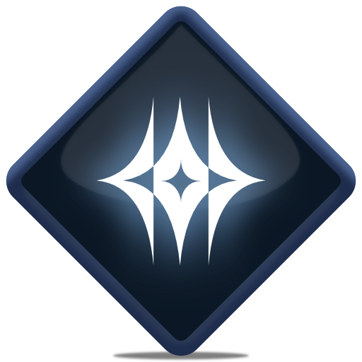

<div align="center">
  
</div>

<h1 align="center">Darkspore BMDL Importer</h1>
<p align="center">Blender add-on to import Darkspore <code>.bmdl</code> models, materials, skinning, and embedded animations.</p>

## Features

* Imports Darkspore `.bmdl` meshes (auto-detects index sizes and triangle modes)
* Builds an Armature from the file’s skeleton and binds meshes with vertex weights
* Reconstructs materials with Principled BSDF (base color & normal map), optional UV checker preview
* Texture resolving by filename **and** FNV-1 hash (Darkspore hash), with limited folder depth search
* Animation import: per-bone Location / Rotation(Quaternion or Euler) / Scale, rest-pose aware
* Optional custom normals application; UV V-flip toggle
* Per-mesh joining of renderables (or keep per-slot objects)
* Detailed import logs and missing texture reports

## Supported Filetypes

* **`.bmdl`** — Darkspore model container (includes skeleton and animations)

## Requirements

* **Blender**: 4.5.0 or newer
* **License**: GPL-3.0-or-later
* **Authors**: JeanxPereira, foehammer

## Installation

1. Download/clone this repository.
2. Zip the `io_darkspore` folder (so the archive root contains `__init__.py`, etc.).
3. In Blender: **Edit → Preferences → Add-ons → Install…** and select the zip.
4. Enable **Darkspore BMDL Importer**.
5. Access via **File → Import → Darkspore (.bmdl)**.

> Alternate (developer) install: copy/symlink `io_darkspore` into
> `C:\Program Files\Blender Foundation\Blender 4.5\4.5\scripts\addons_core\` (Windows)
> or the equivalent `scripts/addons` path on your OS.

## How to Use

### Basic (UI)

1. **File → Import → Darkspore (.bmdl)**
2. Select one or more `.bmdl` files.
3. (Optional) Enable **Import Textures** and either:

   * leave default search (looks for nearby `~animations` / `animations~` folders), or
   * enable **Use Custom Texture Path** and pick your textures directory.
4. (Optional) Enable **Import Animations** to bake actions on the created armature.
5. Import.

### Python Console

```python
import bpy
bpy.ops.import_scene.io_darkspore(
    filepath="D:/Darkspore/models/example.bmdl",
    flip_v=True,
    preview_uv=False,
    apply_custom_normals=False,
    join_renderables=True,
    debug_log=True,
    dry_run=False,
    import_textures=True,
    use_custom_texture_dir=True,
    textures_dir="D:/Darkspore/textures",
    import_animations_opt=True,
    # UI exposes Axis Forward / Axis Up and "Apply Axis to Vertices"
)
```

## Importer Options

* **Apply Axis to Vertices**: Applies the chosen **Axis Forward/Up** to geometry/animation channels.
* **Flip V**: Flips V during UV write (helpful for most DDS/TGA sources).
* **Preview UV (Checker)**: Adds a UV checker material to the imported object; choose **UV Index**.
* **Apply Custom Normals**: Injects decoded vertex normals as split normals (skipped for very large meshes).
* **Join Renderables (per mesh)**: Merges renderable slots into a single mesh per BMDL mesh (material slots preserved).
* **Debug Log**: Prints/scopes per-mesh stats and decisions; also writes a sidecar log file (see Logs).
* **Dry Run (no mesh build)**: Scans and scores index modes without building meshes (debugging).
* **Import Animations**: Bakes actions onto the generated armature, mapping time to Blender frames.
* **Import Textures**:

  * **Use Custom Texture Path** + **Custom Texture Path**: Choose a directory to search for textures.
  * Otherwise, searches a few candidate folders near the `.bmdl` (e.g., `~animations`, `animations~`).

### Material Reconstruction

* **Base Color**: keys accepted (case-insensitive): `diffusemap`, `albedomap`, `basecolormap`, `albedo`, `basecolor`, `colormap`, `color`, `diffuse`.
* **Normal Map**: `normalmap`, `bumpmap`, `normal`.
* The importer resolves textures by **name** or **Darkspore FNV-1 hash**, turns off straight alpha to avoid haloing, and sets:

  * **Specular** from `reflectlevel` (if present)
  * **Normal strength** from `normallevel`
  * **Emission Strength** from `max(emissivelevel, glowlevel) * difflevel`
  * **UV scale/offset** from `tileuv`, `offsetuv`
* If no textures are found, an empty Principled material is created.

### Animation Notes

* Location keys are treated as absolute and converted to local space against the armature’s rest pose.
* Quaternion keys are normalized with shortest-arc flips for continuity; Euler baking is available if selected.
* Time mapping: file times map to Blender frames (auto-scales when the file stores normalized time).

## Examples

#### Import with UV preview and per-mesh join

```python
bpy.ops.import_scene.io_darkspore(
    filepath="D:/Darkspore/models/creature.bmdl",
    preview_uv=True,
    preview_uv_index=0,
    join_renderables=True
)
```

#### Import with custom textures folder and animations

```python
bpy.ops.import_scene.io_darkspore(
    filepath="D:/Darkspore/models/weapon.bmdl",
    import_textures=True,
    use_custom_texture_dir=True,
    textures_dir="D:/Darkspore/textures",
    import_animations_opt=True
)
```

## Output & Logs

* **Per-mesh scan log**: `<file>.darkspore_import.log.txt`
  Summarizes chosen index mode, vertex counts, renderable segments, etc.
* **Missing/Resolved textures**: `<file>.darkspore_import.missing_textures.log.txt`
  Records which hints/hashes were searched and what got resolved.
* **Animation log**: `<file>.darkspore_anim.log.txt`
  Lists track parsing warnings (non-monotonic keys, range clamps), imported actions summary.

## Tips & Troubleshooting

* If normals look off, try disabling **Apply Custom Normals** (let Blender recompute) or verify the chosen **Axis**.
* If textures don’t link, turn on **Debug Log** and check the missing-textures log to confirm search roots and hashes.
* Very large meshes: custom normals are skipped to keep memory reasonable.
* UVs upside-down? Keep **Flip V** on (default).

## Development

* Project metadata in `blender_manifest.toml` and `pyproject.toml`.
* Code style: Black/Ruff (line length 120).
* Package discovery includes `io_darkspore*`.
* Primary modules:

  * `bmdl_core.py` — parsing, vertex/index decoding, materials/streams, animation decoding
  * `io_mesh.py` — mesh build, UV/color/normal writes, Principled material builder, texture search
  * `io_armature.py` — armature creation, bind pose transforms, skinning (weights/indices)
  * `io_anim.py` — action baking, axis application for channels, time/frame mapping
  * `utils.py` — axis matrix helper, Darkspore FNV-1 hash utilities

## Roadmap

* Additional material channels (emissive/color masks) as nodes
* Optional per-slot import (no join) and per-slot texture overrides in UI
* Axis conversion & time mapping presets per-game asset

## Credits

* **foehammer** — specs and prior research into Darkspore formats
* Community research on file structures and hashing

---

**Menu Path:** `File → Import → Darkspore (.bmdl)`
**Tracker:** [https://github.com/JeanxPereira/BMDL-Importer/issues/](https://github.com/JeanxPereira/BMDL-Importer/issues/)
