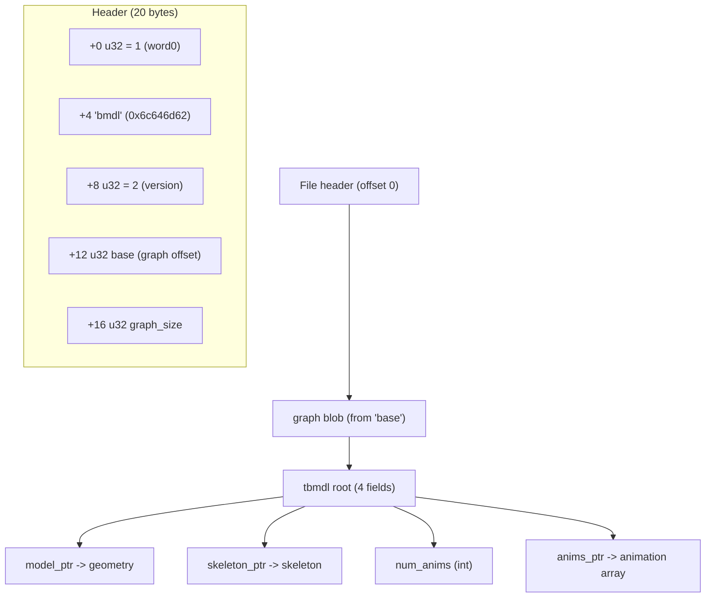
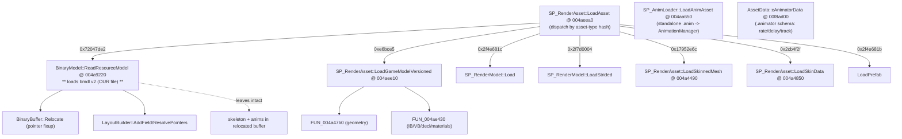

# BMDL — Animation format (reverse engineering)

Reference for the BMDL Importer animation subsystem.
Sources: (1) raw bytes of `creatureeditor_el_anime_arm.bmdl`, (2) `Darkspore.exe` decompiled in
Ghidra. Each statement is tagged **[measured]** (verified against file bytes) or **[binary]**
(confirmed in game code).

---

## 1. BMDL v2 container

The file is a serialized *graph*: a blob with pointers **relative to `base`** that the game
"relocates" (converts to absolute) at load time.



**[binary]** `BinaryModel::ReadResourceModel @ 004a9220` checks exactly `word0==1`,
`word1=="bmdl"`, `word2==2`, calls `BinaryBuffer::Relocate`, then `src = *pRelocatedBase`. The four
root fields are read as `pRelocatedBase[0..3]` = **model, skeleton, num_anims, anims**. The branch
`if (skeleton==0 && anims==0) free(animBuffer)` confirms `[1]=skeleton` and `[3]=anims`.

**[measured]** In `creatureeditor_el_anime_arm.bmdl`: `base=3216`, `graph_size=866660`,
root = `[16, 836620, 4, 838748]` → 4 animations (`idle`, `activate`, `up`, `retract`).

> ⚠️ **Important:** `ReadResourceModel` copies/uploads the *geometry* to the GPU, but the
> **skeleton and animations stay in the relocated buffer** (`model+0x1c`, `model+0x24`, buffer at
> `model+0x30`) and are consumed later by the runtime animation system. That is why the addon reads
> these sections straight from the file — which is correct.

---

## 2. Structure layout (all offsets confirmed)

### tbmdl root
| off | type | field |
|----:|------|-------|
| +0  | u32  | model_ptr |
| +4  | u32  | skeleton_ptr |
| +8  | i32  | num_anims |
| +12 | u32  | anims_ptr |

### Skeleton  *(bone stride = 80 bytes)*
| off | type | field |
|----:|------|-------|
| +0  | i32  | num_bones |
| +4  | u32  | bones_ptr |

### Bone (80 bytes)
| off | type      | field |
|----:|-----------|-------|
| +0  | u32       | name_ptr |
| +4  | u32       | name_hash (FNV-1) |
| +8  | i32       | parent_index (-1 = root) |
| +12 | u32       | pad |
| +16 | float[16] | **inverse-bind matrix** (model-space, D3D row-major; translation in m[12..14]) |

**[measured]** Under identity rotation, `world_pos = -translation(inverse_bind)`. E.g.
`head_rota` inverse-bind tz = −4.265 → world z = +4.265.

### Anim header (20 bytes)
| off | type | field |
|----:|------|-------|
| +0  | u32  | name_ptr |
| +4  | u32  | name_hash |
| +8  | f32  | **duration** (in *frames*; idle = 799) |
| +12 | u32  | num_tracks |
| +16 | u32  | tracks_ptr |

### Track (20 bytes)
| off | type | field |
|----:|------|-------|
| +0  | i32  | bone_index |
| +4  | u32  | category (1=POS, 2=ROT, 3=SCALE) |
| +8  | u32  | **num_keys** (the old code mislabeled this `flags`) |
| +12 | u32  | times_ptr  (→ `num_keys` floats) |
| +16 | u32  | values_ptr (→ `num_keys * dim` floats) |

`dim`: POS=3, ROT=4 (quaternion **xyzw**), SCALE=3.

**[measured]** Across 70 tracks × 4 anims, `num_keys` (field +8) == `(values_ptr - times_ptr)/4` in
**all** of them. Deriving `n` from the pointer difference happens to match, but the explicit field is +8.


---

## 3. Value semantics — **LOCAL, parent-relative**  [measured]

For each bone, cross-check track `POS[0]` against the **world** translation (derived from the
inverse-bind) and the **local** one (`world − parent_world`):

| bone | parent | world | local (w−wp) | POS[0] track | match |
|------|--------|-------|--------------|--------------|-------|
| head_rota | Root | (0,0,4.265) | (0,0,4.265) | (0,0,4.265) | both* |
| L_arm | arm_rota | (−1.422,0,5.873) | (−1.422,0,−0.075) | (−1.422,0,−0.075) | **LOCAL** |
| Lerbow | L_arm | (−2.501,0,6.577) | (−1.080,0,0.703) | (−1.080,0,0.703) | **LOCAL** |
| L_body | Lerbow | (−2.495,−0.168,3.821) | (0.006,−0.168,−2.756) | (0.006,−0.168,−2.756) | **LOCAL** |
| … (24/24) | | | | | **LOCAL** |

\* bones near the root match both because the parent is at the origin (local == world). Every bone
whose parent is off-origin matches **only** LOCAL.

> **Conclusion:** tracks store **parent-relative local TRS** (standard hierarchical animation). At
> rest, `POS == local bind translation`, `ROT == identity`, `SCALE == 1`. Quaternion order is
> **xyzw** (w last): e.g. `head_rota` ROT = `(0,0,0.1005,0.9949)` ≈ 11.5° about Z — consistent; as
> wxyz it would be 180° (nonsense).

---

## 4. Ghidra function map (Darkspore.exe)



**Named functions (confirmed):**
- `SP_RenderAsset::LoadAsset @ 004aeea0` — dispatcher by asset-type hash.
- `BinaryModel::ReadResourceModel @ 004a9220` — **bmdl v2 loader** (our case).
- `SP_RenderAsset::LoadGameModelVersioned @ 004aee10` — versioned (v8/v9) streamed format.
- `SP_AnimLoader::LoadAnimAsset @ 004aa650` — loads a standalone `.anim` and registers it in `AnimationManager`.
- `AssetData::cAnimatorData @ 00f8ad00` — reflection descriptor for the `.animator` (gameplay) asset.

Ghidra structs defined: `bmdl_TbmdlRoot`, `bmdl_Skeleton`, `bmdl_Bone`, `bmdl_AnimHeader`,
`bmdl_AnimTrack` (plate comment on `ReadResourceModel @ 004a9220`).

**Not located:** the runtime *sampler* that interpolates `times/values` and composes the local TRS
into bone matrices (likely in `AnimationManager` / creature render). Not needed for the parse — the
semantics are measured above — but it would confirm the exact composition order.

---

## 5. Root causes of the broken animation (now fixed)

| # | root cause | evidence |
|---|-----------|----------|
| 0 | **Blender 5.1 removed `Action.groups` and `Action.fcurves`** (new slotted system: slot+layer+strip+channelbag). The addon used `act.groups`/`act.fcurves.new` → `AttributeError`, so **no** animation was created at all | crash reproduced in Blender |
| 1 | POS/ROT/SCALE are **parent-relative local**, but the addon treated POS as absolute and did a global→local conversion | **[measured]** 24/24 bones match LOCAL |
| 2 | Track field `+8` is **num_keys**, not `flags` | **[measured]** 280 tracks |
| 3 | `map_frames` applied a heuristic time scale | times and duration are already in the **same unit (frames)** |
| 4 | Quaternion order is xyzw | **[measured]** |

### ✅ Fix (implemented and verified)
`io_anim.py` rewritten with a closed-form bake; `__init__.py` passes `anim_bones`/`anim_build_m3`.
Per-frame math:

```
local        = Translation(T) @ quat(wxyz).to_matrix() @ Diagonal(S)   # local -> parent
world[bone]  = world[parent] @ local[bone]                             # chain
D            = world[bone] @ inv_bind[bone]                            # deformation (identity at rest)
pose[bone]   = A @ D @ A^-1 @ matrix_local[bone]    (A = the m3 4x4 used by build_armature)
basis[bone]  = rel_rest[bone]^-1 @ pose[parent]^-1 @ pose[bone]
# basis.decompose() -> location / rotation_quaternion / scale (fcurves via channelbag)
```

**Verification (Blender 5.1, real addon code):**
- Frame 0: every bone's deformation == identity (error ~2e-6) → correct rest.
- Frames 340/500/799: `pb.matrix @ matrix_local^-1` == `A @ D_game @ A^-1` (error ~2e-6).
- `head_rota` @340 deforms 19.73° about Z == `2·asin(0.1713)` from the track. ✓
- 4 animations imported; 240 fcurves in `idle`.

The closed form is **robust to the approximate rest orientation** `build_armature` produces
(bone points to child), because `A` and `matrix_local` cancel at rest.

---

## 6. Verification scripts
Standalone dumps (next to the test file): `_dump_anim.py` (headers/tracks),
`_dump_anim2.py` (matrices + values), `_dump_anim3.py` (local-vs-absolute test over all bones).
