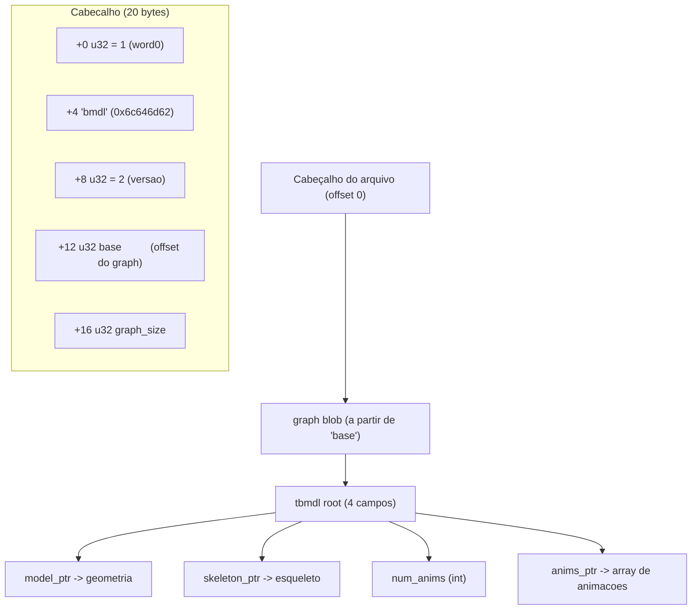
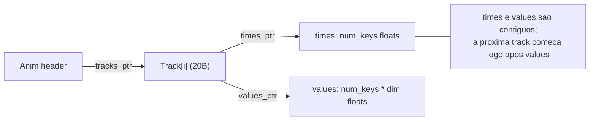
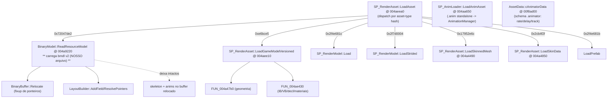
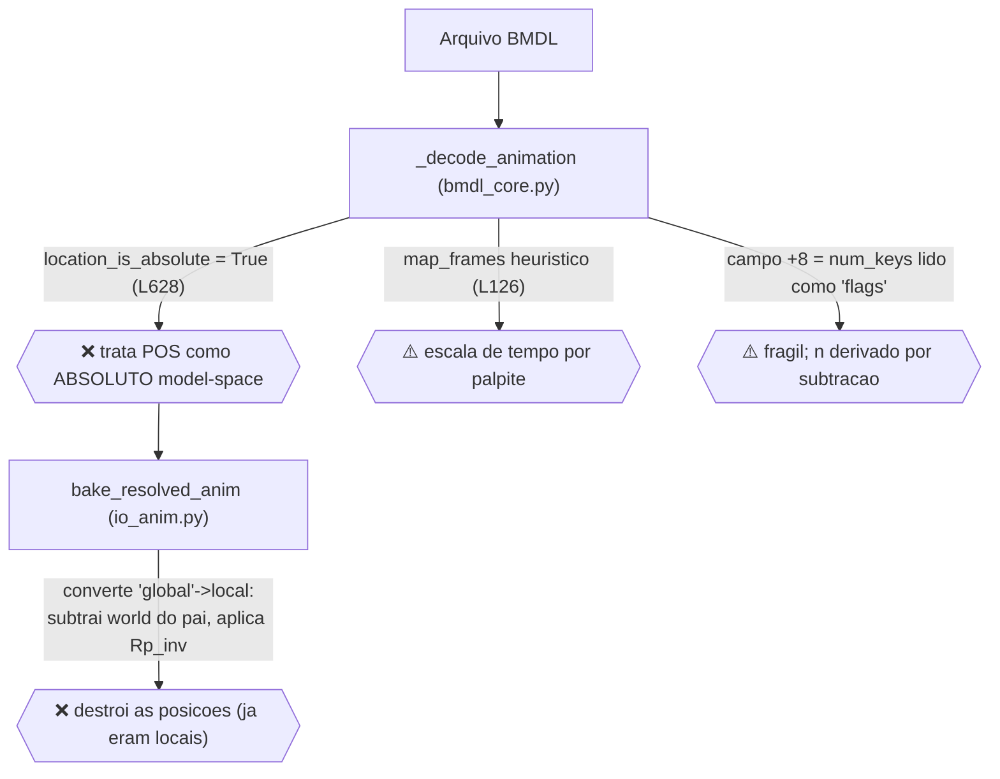

# BMDL — Formato de Animação (engenharia reversa)

> Documento de referência para o subsistema de animação do BMDL Importer.
> Fontes: (1) bytes reais de `creatureeditor_el_anime_arm.bmdl`, (2) decompilação do
> `Darkspore.exe` via Ghidra. Cada afirmação está marcada como **[medido]** (verificado
> nos bytes do arquivo) ou **[binário]** (confirmado no código do jogo).

---

## 1. Container BMDL v2

O arquivo é um *graph* serializado: um blob com ponteiros **relativos a `base`** que o
jogo "reloca" (converte para absolutos) ao carregar.



**[binário]** `BinaryModel::ReadResourceModel @ 004a9220` valida exatamente
`word0==1`, `word1=="bmdl"`, `word2==2`, chama `BinaryBuffer::Relocate`, e então
`src = *pRelocatedBase`. Os 4 campos da raiz são lidos como
`pRelocatedBase[0..3]` = **model, skeleton, num_anims, anims**.
A condição `if (skeleton==0 && anims==0) free(animBuffer)` confirma que `[1]=skeleton`
e `[3]=anims`.

**[medido]** Em `creatureeditor_el_anime_arm.bmdl`: `base=3216`, `graph_size=866660`,
root = `[16, 836620, 4, 838748]` → 4 animações (`idle`, `activate`, `up`, `retract`).

> ⚠️ **Importante:** `ReadResourceModel` copia/sobe a *geometria* para a GPU, mas
> **esqueleto e animações ficam no buffer relocado** (`model+0x1c`, `model+0x24`,
> buffer em `model+0x30`) e são consumidos depois pelo runtime de animação. Por isso o
> addon lê essas seções direto do arquivo — está correto fazer assim.

---

## 2. Layout das estruturas (todos os offsets confirmados)

### tbmdl root
| off | tipo | campo |
|----:|------|-------|
| +0  | u32  | model_ptr |
| +4  | u32  | skeleton_ptr |
| +8  | i32  | num_anims |
| +12 | u32  | anims_ptr |

### Skeleton  *(stride do bone = 80 bytes)*
| off | tipo | campo |
|----:|------|-------|
| +0  | i32  | num_bones |
| +4  | u32  | bones_ptr |

### Bone (80 bytes)
| off | tipo      | campo |
|----:|-----------|-------|
| +0  | u32       | name_ptr |
| +4  | u32       | name_hash (FNV-1a) |
| +8  | i32       | parent_index (-1 = raiz) |
| +12 | u32       | pad |
| +16 | float[16] | **inverse-bind matrix** (model-space, row-major D3D; translação em m[12..14]) |

**[medido]** Sob rotação identidade, `world_pos = -translação(inverse_bind)`. Ex.:
`head_rota` inverse-bind tz = −4.265 → posição world z = +4.265.

### Anim header (20 bytes)
| off | tipo | campo |
|----:|------|-------|
| +0  | u32  | name_ptr |
| +4  | u32  | name_hash |
| +8  | f32  | **duration** (em *frames*; idle=799) |
| +12 | u32  | num_tracks |
| +16 | u32  | tracks_ptr |

### Track (20 bytes)  ← **AQUI ESTÁ O BUG PRINCIPAL DE PARSE**
| off | tipo | campo | addon atual |
|----:|------|-------|-------------|
| +0  | i32  | bone_index | ok |
| +4  | u32  | category (1=POS, 2=ROT, 3=SCALE) | ok |
| +8  | u32  | **num_keys** | ❌ rotulado como `flags` e **ignorado** |
| +12 | u32  | times_ptr  (→ `num_keys` floats) | ok |
| +16 | u32  | values_ptr (→ `num_keys * dim` floats) | ok |

`dim`: POS=3, ROT=4 (quaternion **xyzw**), SCALE=3.

**[medido]** Em 70 tracks × 4 anims, `num_keys` (campo +8) == `(values_ptr - times_ptr)/4`
em **todas**. O addon deriva `n` pela subtração de ponteiros e por isso *acerta o número
de keys por coincidência aritmética* — mas o campo correto/explícito é o +8.



---

## 3. Semântica dos valores — **LOCAL, relativo ao pai**  [medido]

Teste cruzando, para cada osso, `POS[0]` da track contra a translação **world**
(derivada da inverse-bind) e a **local** (`world − world_pai`):

| osso | pai | world | local (w−wp) | POS[0] track | bate |
|------|-----|-------|--------------|--------------|------|
| head_rota | Root | (0,0,4.265) | (0,0,4.265) | (0,0,4.265) | ambos* |
| L_arm | arm_rota | (−1.422,0,5.873) | (−1.422,0,−0.075) | (−1.422,0,−0.075) | **LOCAL** |
| Lerbow | L_arm | (−2.501,0,6.577) | (−1.080,0,0.703) | (−1.080,0,0.703) | **LOCAL** |
| L_body | Lerbow | (−2.495,−0.168,3.821) | (0.006,−0.168,−2.756) | (0.006,−0.168,−2.756) | **LOCAL** |
| … (24/24) | | | | | **LOCAL** |

\* ossos perto da raiz coincidem porque o pai está na origem (local == world).
Todos os ossos com pai fora da origem batem **somente** com LOCAL.

> **Conclusão:** as tracks armazenam **TRS local relativo ao pai** (animação hierárquica
> padrão). No rest, `POS == translação local de bind`, `ROT == identidade`, `SCALE == 1`.
> Quaternion em ordem **xyzw** (w por último): ex. `head_rota` ROT = `(0,0,0.1005,0.9949)`
> = ~11.5° em Z — coerente; em wxyz seria 180° (absurdo).

---

## 4. Mapa das funções no Ghidra (Darkspore.exe)



**Funções já nomeadas (confirmadas):**
- `SP_RenderAsset::LoadAsset @ 004aeea0` — dispatcher por hash de tipo de asset.
- `BinaryModel::ReadResourceModel @ 004a9220` — **loader do bmdl v2** (nosso caso).
- `SP_RenderAsset::LoadGameModelVersioned @ 004aee10` — formato versionado (v8/v9), streamed.
- `SP_AnimLoader::LoadAnimAsset @ 004aa650` — carrega `.anim` separado e registra no `AnimationManager`.
- `AssetData::cAnimatorData @ 00f8ad00` — descritor de reflexão do asset `.animator` (gameplay).

**Ainda não localizado:** o *sampler* runtime que interpola `times/values` e compõe o TRS
local em matrizes de osso (provável em `AnimationManager` / sistema de render de criaturas).
Não necessário para o parse — a semântica já está medida acima — mas útil para confirmar a
ordem exata de composição numa próxima rodada.

---

## 5. Diagnóstico da quebra no addon



| # | Causa-raiz | Onde | Evidência |
|---|-----------|------|-----------|
| 0 | **Blender 5.1 removeu `Action.groups` e `Action.fcurves`** (novo sistema slotted: slot+layer+strip+channelbag). O addon usava `act.groups`/`act.fcurves.new` → `AttributeError`, **nenhuma** animação era criada | `io_anim.py` (ensure_group/ensure_fcurve antigos) | crash reproduzido no Blender |
| 1 | POS/ROT/SCALE são **locais (relativos ao pai)**, mas o addon marcava POS como absoluto e fazia conversão global→local | `bmdl_core.py:628`, `io_anim.py` (bake antigo) | **[medido]** 24/24 ossos batem LOCAL |
| 2 | O campo `+8` da track é **num_keys**, não `flags` | `bmdl_core.py` (`RawTrack.flags`) | **[medido]** 280 tracks |
| 3 | `map_frames` aplicava escala de tempo heurística | `io_anim.py` (antigo) | times e duration já estão na **mesma unidade (frames)** |
| 4 | Ordem do quaternion configurável, default xyzw | `bmdl_core.py:638` | **[medido]** xyzw correto |

### ✅ Correção implementada e verificada
Reescrito `io_anim.py` (bake em forma fechada) + plumbing em `__init__.py` (passa
`anim_bones`/`anim_build_m3`). Math por frame:

```
local        = Translation(T) @ quat(wxyz).to_matrix() @ Diagonal(S)   # local->pai
world[osso]  = world[pai] @ local[osso]                                # cadeia
D            = world[osso] @ inv_bind[osso]                             # deformacao (I no rest)
pose[osso]   = A @ D @ A^-1 @ matrix_local[osso]    (A = m3 4x4 do build_armature)
basis[osso]  = rel_rest[osso]^-1 @ pose[pai]^-1 @ pose[osso]
# basis.decompose() -> location / rotation_quaternion / scale (fcurves via channelbag)
```

**Verificação (Blender 5.1, código real do addon):**
- Frame 0: deformação de todos os ossos == identidade (erro ~2e-6) → rest correto.
- Frames 340/500/799: `pb.matrix @ matrix_local^-1` == `A @ D_game @ A^-1` (erro ~2e-6).
- `head_rota` @340 deforma 19.73° em Z == `2·asin(0.1713)` da track. ✓
- 4 animações importadas; 240 fcurves no `idle`.

A forma fechada é **robusta à orientação aproximada do rest** que `build_armature` gera
(bone aponta-para-filho), pois `A` e `matrix_local` se cancelam no rest.

---

## 6. Scripts de verificação
Dumps standalone usados (na pasta do arquivo de teste):
`_dump_anim.py` (headers/tracks), `_dump_anim2.py` (matrizes + valores),
`_dump_anim3.py` (teste local-vs-absoluto em todos os ossos).
