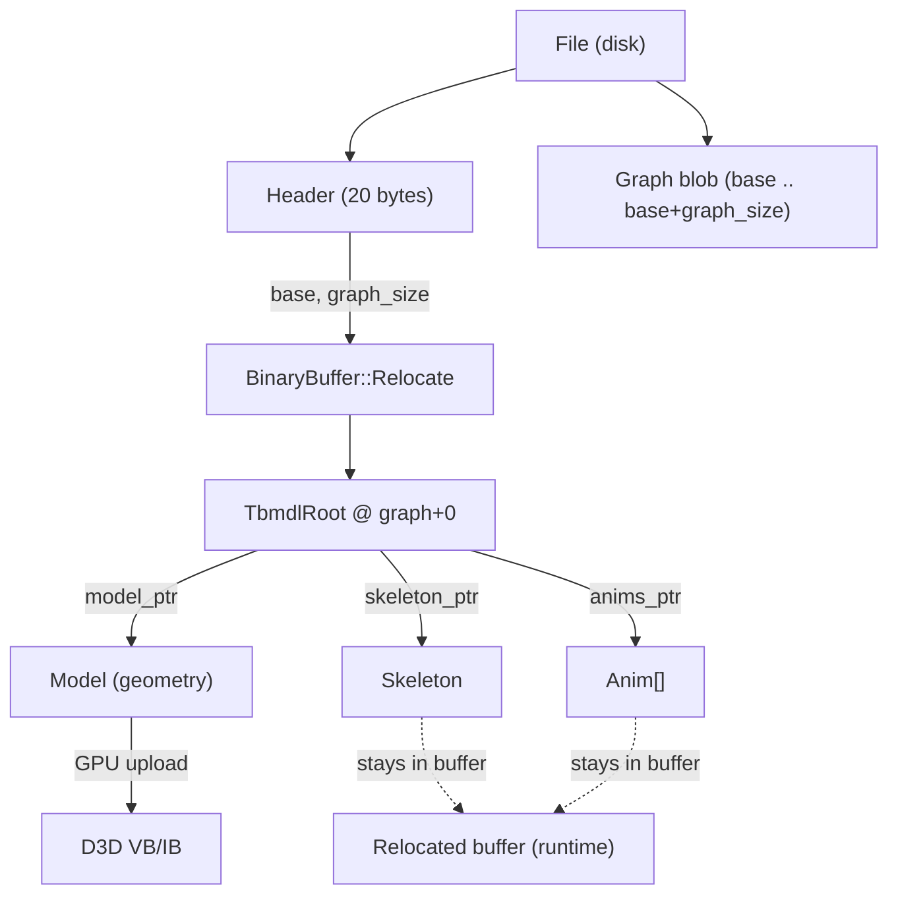
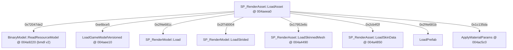
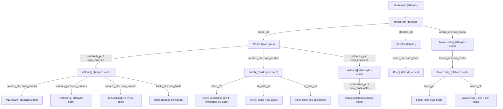

# BMDL v2 — Master Format Specification

Single source of truth: struct layouts are defined in `bmdl_schema.py`.
Validation tool: `tools/validate_bmdl.py` (see [Section 6](#6-source-of-truth--validation-sweep)).

Cross-references:
- Animation subsystem detail: [BMDL_ANIMATION.md](BMDL_ANIMATION.md)
- Material/shader detail: [BMDL_MATERIALS.md](BMDL_MATERIALS.md)

Tags: **[measured]** = verified against raw file bytes; **[binary]** = confirmed in Darkspore.exe via Ghidra; **[sweep]** = observed across the full local corpus via `tools/validate_bmdl.py`.

---

## 1. Container & Header

Every `.bmdl` file begins with a 20-byte fixed header, followed immediately by the *graph blob*.

| offset | type | value / meaning |
|-------:|------|-----------------|
| +0     | u32  | `1` (word0 sentinel) |
| +4     | char[4] | `bmdl` (bytes `62 6D 64 6C`) |
| +8     | u32  | `2` (version; `ReadResourceModel` rejects anything else) |
| +12    | u32  | `base` — file offset where the graph blob starts |
| +16    | u32  | `graph_size` — byte length of the graph blob |

**[binary]** `BinaryModel::ReadResourceModel @ 004a9220` checks `word0 == 1`, magic == `"bmdl"`, `version == 2`, then calls `BinaryBuffer::Relocate`.

**Pointers are graph-relative.** Every `ptr` / `cstr` field stores a `u32` offset from `base` (not from the start of the file). A value of `0` means null. After relocation the game adds `base` to each pointer; the importer performs the same arithmetic via `Reader._abs(graphrel) = base + graphrel`.

**[measured]** Example (`creatureeditor_el_anime_arm.bmdl`): `base = 3216`, `graph_size = 866660`.

---

## 2. Graph Relocation

**[binary]** Load sequence in `BinaryModel::ReadResourceModel @ 004a9220`:

1. Validate header (word0, magic, version).
2. Call `BinaryBuffer::Relocate` — walks every pointer slot in the graph blob and converts each graph-relative offset to an absolute in-process address.
3. Read the `TbmdlRoot` at graph offset 0 (`*pRelocatedBase`). The four root fields are `pRelocatedBase[0..3]` = `model_ptr`, `skeleton_ptr`, `num_anims`, `anims_ptr`.
4. Upload geometry to the GPU: mesh vertex buffers and index buffers are `CreateVertexBuffer` / `CreateIndexBuffer` / `memcpy`-ed from the graph.
5. The skeleton and animations **stay in the relocated buffer** (`model+0x1c`, `model+0x24`, buffer at `model+0x30`) and are consumed later by the runtime animation system.



---

## 3. Asset Dispatch

**[binary]** `SP_RenderAsset::LoadAsset @ 004aeea0` dispatches by a 32-bit asset-type hash.

| hash | loader |
|------|--------|
| `0x72047de2` | `BinaryModel::ReadResourceModel @ 004a9220` — **bmdl v2 (this document)** |
| `0xe6bce5`   | `SP_EditorModel::LoadFromText` / `LoadGameModelVersioned @ 004aee10` |
| `0x2f4e681c` | `SP_RenderModel::Load` |
| `0x2f7d0004` | `SP_RenderModel::LoadStrided` |
| `0x17952e6c` | `SP_RenderAsset::LoadSkinnedMesh @ 004a4490` |
| `0x2cb4f2f`  | `SP_RenderAsset::LoadSkinData @ 004a4850` |
| `0x2f4e681b` | `LoadPrefab` |
| `0x1c135da`  | `ApplyMaterialParams @ 004ac5c0` |



---

## 4. bmdl v2 Structure Tree



---

## 5. Struct Layouts

All offsets are byte offsets within the struct. All values are little-endian. Sources: comments and field definitions in `bmdl_schema.py`.

### TbmdlRoot (stride 16 bytes)

Root of the graph blob; located at graph offset 0.

| offset | type | field |
|-------:|------|-------|
| +0     | ptr  | `model_ptr` |
| +4     | ptr  | `skeleton_ptr` |
| +8     | i32  | `num_anims` |
| +12    | ptr  | `anims_ptr` |

### Model (stride 0x48 = 72 bytes)

**[binary]** Confirmed by `BinaryModel::ReadResourceModel @ 004a9220` LayoutBuilder AddField calls. Offsets +0..+0x1f are GPU-side bookkeeping (not in this table); the named fields begin at +0x20.

| offset | type | field |
|-------:|------|-------|
| +0x20  | cstr | `name_ptr` |
| +0x28  | i32  | `num_materials` |
| +0x2c  | ptr  | `materials_ptr` |
| +0x30  | i32  | `num_meshes` |
| +0x34  | ptr  | `meshes_ptr` |
| +0x38  | i32  | `num_instances` |
| +0x3c  | ptr  | `instances_ptr` |
| +0x40  | i32  | `num_tags` |
| +0x44  | ptr  | `tags_ptr` |

### Material (stride 44 bytes)

**[measured + binary]** Confirmed in `ApplyMaterialParams @ 004ac5c0`. Ghidra struct: `bmdl_Material`.

| offset | type | field |
|-------:|------|-------|
| +0     | cstr | `name_ptr` (shader name, e.g. `labsChromeVertColor`) |
| +4     | u32  | `name_hash` (FNV-1, lowercase) |
| +8     | u32  | `flags` |
| +12    | i32  | `num_params` |
| +16    | ptr  | `params_ptr` → `MatParam[]` |
| +20    | i32  | `num_floats` |
| +24    | ptr  | `floats_ptr` → `float[]` (packed constant buffer) |
| +28    | i32  | `num_textures` |
| +32    | ptr  | `textures_ptr` → `TexBinding[]` |
| +36    | i32  | `num_streams` |
| +40    | ptr  | `streams_ptr` → `TexBinding[]` (vertex stream bindings) |

### MatParam (stride 16 bytes)

**[measured + binary]** Ghidra struct: `bmdl_MatParam`. Value = `floats[float_offset : float_offset + dimension]`.

| offset | type | field |
|-------:|------|-------|
| +0     | cstr | `name_ptr` |
| +4     | u32  | `name_hash` |
| +8     | u32  | `float_offset` (index into the parent material's float array) |
| +12    | u32  | `dimension` (number of floats) |

### TexBinding (stride 16 bytes)

**[measured]** Ghidra struct: `bmdl_TexBinding`. Used for textures (key = slot, value = filename) and vertex stream bindings (key = semantic, value = source).

| offset | type | field |
|-------:|------|-------|
| +0     | cstr | `key_ptr` |
| +4     | u32  | `key_hash` |
| +8     | cstr | `value_ptr` |
| +12    | u32  | `value_hash` |

### Skeleton (stride 8 bytes)

| offset | type | field |
|-------:|------|-------|
| +0     | i32  | `num_bones` |
| +4     | ptr  | `bones_ptr` |

### Bone (stride 80 bytes)

**[measured]** Bone stride confirmed by `read_array` with stride 80. Inverse-bind matrix is model-space, D3D row-major; translation is in columns 12..14 (`m[12]`..`m[14]`).

| offset | type   | field |
|-------:|--------|-------|
| +0     | cstr   | `name_ptr` |
| +4     | u32    | `name_hash` (FNV-1) |
| +8     | i32    | `parent_index` (`-1` = root bone) |
| +12    | u32    | `pad` |
| +16    | f32x16 | `inv_bind` (16 floats = 4×4 inverse-bind matrix) |

### AnimHeader (stride 20 bytes)

**[measured]** Ghidra struct: `bmdl_AnimHeader` (plate comment on `ReadResourceModel @ 004a9220`).

| offset | type | field |
|-------:|------|-------|
| +0     | cstr | `name_ptr` |
| +4     | u32  | `name_hash` |
| +8     | f32  | `duration` (in frames) |
| +12    | u32  | `num_tracks` |
| +16    | ptr  | `tracks_ptr` |

### AnimTrack (stride 20 bytes)

**[measured]** Ghidra struct: `bmdl_AnimTrack`. `category`: 1 = POS (dim 3), 2 = ROT quaternion xyzw (dim 4), 3 = SCALE (dim 3). `times_ptr` and `values_ptr` are contiguous: `values_ptr - times_ptr == num_keys * 4` (validated across all tracks in the corpus).

| offset | type | field |
|-------:|------|-------|
| +0     | i32  | `bone_index` |
| +4     | u32  | `category` |
| +8     | u32  | `num_keys` |
| +12    | ptr  | `times_ptr` (→ `num_keys` f32 values) |
| +16    | ptr  | `values_ptr` (→ `num_keys × dim` f32 values) |

### Mesh (stride 0x44 = 68 bytes)

**[binary]** Loop `byteOff += 0x44` confirmed in `ReadResourceModel @ 004a9220`. First 0x20 bytes are a bounding box (8 floats: min[3], pad, max[3], pad/volume) — not modelled here. Index buffer uses 16-bit indices: `memcpy` size = `index_count * 2`.

| offset | type | field |
|-------:|------|-------|
| +0x20  | cstr | `name_ptr` |
| +0x2c  | u32  | `flags` |
| +0x30  | ptr  | `vdecl_ptr` (→ 0xFF-terminated vertex declaration array) |
| +0x34  | ptr  | `vb_data_ptr` (raw vertex buffer bytes) |
| +0x38  | ptr  | `ib_data_ptr` (raw index buffer, 16-bit indices) |
| +0x3c  | u32  | `vertex_count` |
| +0x40  | u32  | `index_count` |

### Instance / LOD (stride 0x2c = 44 bytes)

**[binary]** Source stride 0x2c, GPU-side copy stride 0x24; confirmed by LayoutBuilder AddField `byteOff += 0x2c`. First 0x18 bytes are a bounding box (6 floats) — not modelled here. `mesh_index` selects which `Mesh`'s VB/IB this LOD draws.

| offset | type | field |
|-------:|------|-------|
| +0x20  | u32  | `mesh_index` |
| +0x24  | i32  | `num_renderables` |
| +0x28  | ptr  | `renderables_ptr` |

### Renderable (stride 0x2c = 44 bytes)

**[binary]** Loop `subSrcByteOff += 0x2c` confirmed in `ReadResourceModel`. First 0x18 bytes are a bounding box (6 floats). `index_start + index_count` partitions the owning mesh's index buffer **[measured]** (verified on `scaldron_terrain_a.bmdl`). Engine lookup: `material_index * 0x30 + materials_base`.

| offset | type | field |
|-------:|------|-------|
| +0x20  | i32  | `material_index` |
| +0x24  | u32  | `index_start` (offset into mesh's 16-bit index buffer) |
| +0x28  | u32  | `index_count` |

### Vertex Declaration Element (8 bytes per element, 0xFF-terminated)

**[binary]** Confirmed in `ReadResourceModel @ 004a9220`, asm addresses 004a9d0e / 004a9da7 / 004a9e09 / 004a9e26. The array terminates when the `stream` word equals `0xFF` (`CMP word ptr [EAX], 0xff`).

| byte offset | type | field |
|------------:|------|-------|
| +0          | u16  | `stream` (`0xFF` or `0xFFFF` = terminator) |
| +2          | u16  | `offset` (byte offset of this element within the vertex) |
| +4          | u8   | `d3d_usage` (copied verbatim to `D3DVERTEXELEMENT9.Usage`) |
| +5          | u8   | (unused / padding) |
| +6          | u8   | `type_id` (switch selector, see table below) |
| +7          | u8   | `usage_index` (copied verbatim to `D3DVERTEXELEMENT9.UsageIndex`) |

**`type_id` → `D3DDECLTYPE` mapping** (switch at 004a9db1):

| type_id | D3DDECLTYPE value | name |
|--------:|------------------:|------|
| 0 | `0x00` | `FLOAT1` |
| 1 | `0x02` | `FLOAT3` |
| 2 | `0x13` (19) | — |
| 3 | `0x14` (20) | — |
| 4 | `0x06` | `UBYTE4` |
| 5 | `0x03` | `FLOAT4` |
| 6 | `0x0F` (15) | — |
| 7 | `0x0E` (14) | — |
| default | `0xFFFFFFFF` | `UNUSED` |

---

## 6. Source of Truth & Validation [sweep]

`bmdl_schema.py` is the **single source of truth** for all struct layouts. The importer (Phase 2) and `tools/validate_bmdl.py` both import it directly. No heuristics are used; every assertion in the validator is derived from field constraints stated in the schema.

`tools/validate_bmdl.py` parses the entire local corpus (`BMDL_environments`, 1234 files) with zero failures.

**Corpus run output (verbatim):**

```
files=1234 ok=1234 fail=0
struct coverage: {'AnimHeader': 47, 'AnimTrack': 2382, 'Bone': 675, 'Instance': 2271,
'MatParam': 32855, 'Material': 2909, 'Mesh': 2271, 'Model': 1234, 'Renderable': 7530,
'Skeleton': 34, 'TbmdlRoot': 1234, 'TexBinding': 5791}

--- coverage report ---
total structs parsed : 59233
files with zero meshes AND zero anims : 2
```

**Per-struct counts:**

| struct | instances parsed |
|--------|----------------:|
| TbmdlRoot | 1234 |
| Model | 1234 |
| Material | 2909 |
| MatParam | 32855 |
| TexBinding | 5791 |
| Mesh | 2271 |
| Instance | 2271 |
| Renderable | 7530 |
| Skeleton | 34 |
| Bone | 675 |
| AnimHeader | 47 |
| AnimTrack | 2382 |
| **Total** | **59233** |

All 12 struct types are exercised. 2 files contain neither meshes nor animations (likely stub/LOD-only entries).

---

## 7. Alternative Formats

The dispatch table in [Section 3](#3-asset-dispatch) covers all asset types loaded by `SP_RenderAsset::LoadAsset @ 004aeea0`. This document covers only **bmdl v2** (hash `0x72047de2`). The remaining loaders are documented below from the decompilation only — **none of these formats appear in the local `.bmdl` corpus** (which is entirely bmdl v2), so every claim here is tagged **[binary-only]** and was *not* measured against real files or validated by the sweep. Field offsets are stated only where they were directly visible in the decompilation; where a structure is too tangled to pin down, that is called out explicitly rather than guessed.

### 7.0 Streaming vs. relocation (the key difference from bmdl v2)

**[binary-only]** bmdl v2 is the only loader that uses the **relocation** model (one graph blob, `BinaryBuffer::Relocate`, graph-relative pointers — see [Section 2](#2-graph-relocation)). Every alternative loader below instead **streams** the file through a `BinaryStream`/`BufferedBinaryReader` (constructed in `LoadAsset` via `BufferedBinaryReader::Construct(0x2000, …)` when the source magic is `0x34722300`). Two primitives recur:

- **raw read** `read(dst, size)` — `FUN_00b0cea0`: calls reader vtbl `+0x30`, returns true iff exactly `size` bytes were delivered. Used for blob payloads (index/vertex/pixel data), which are therefore **little-endian, in file order**.
- **swapped-dword read** `readDwordSwapped(dst)` — `FUN_00b0cfe0` (and `BinaryStream::ReadDwordsSwapped`): reads a 4-byte dword and **byte-swaps it** (big-endian on disk) unless the reader handle is the sentinel `1`. Used for counts/sizes/flags. So scalar header fields in these formats are stored **big-endian**, unlike bmdl v2's little-endian graph.
- A bounds guard `FUN_004a3eb0(stream, elemSize, count)` checks `elemSize*count <= bytesRemaining` (reader vtbl `+0x2c`) before every large allocation.

### 7.1 GameModel — `0xe6bce5`, versioned v8/v9 (`SP_RenderAsset::LoadGameModelVersioned @ 004aee10`)

**[binary-only]** This is the only alternative loader that is a genuine **geometry/model** format. Entry `004aee10` reads a 4-byte tag (`read(&hdr,4) == 4`), gates on `version - 8 < 2` (i.e. **v8 or v9 only**), then calls two helpers in sequence: `FUN_004a47b0` (pre-pass) and `FUN_004ae430` (main parse). It streams throughout; there is **no relocation step** and no `bmdl` magic.

`FUN_004a47b0` (pre-pass) reads one swapped count, then loops that many times reading 3 swapped dwords each — a small fixed-stride header table consumed before the body. (Purpose not fully resolved; it is a validation/skip pass that must succeed before parsing continues.)

`FUN_004ae430` (main parse) reads the body strictly in this order (all counts/sizes are swapped dwords; all bulk data are raw reads, each preceded by the `FUN_004a3eb0` bounds guard):

1. a leading count (`local_f0`, reused later as the primitive/draw count), plus an 0x18-byte block and a 4-byte field copied into the output model.
2. **Index buffers** — `count`, then per buffer: stride, index-count, **index width in bits** (validated to be exactly `0x10` or `0x20`, i.e. 16- or 32-bit indices), and byte-size (validated as `width*count >> 3`); `RenderDevice::CreateIndexBuffer` → lock → raw read → unlock.
3. **Vertex declarations** — `count`, then per declaration: an element count, `RenderDevice::CreateVertexDeclaration`, then **0x0C bytes per element**, `FinalizeVertexDeclaration`; the finished decl is pushed into a vector at `model+0x88`. (Note the per-element stride here is **12 bytes**, vs. bmdl v2's 8-byte, `0xFF`-terminated declaration — see [Section 5](#5-struct-layouts).)
4. **Vertex buffers** — `count`, then per buffer: a declaration index (into the `model+0x84..0x88` vector), a vertex count, and a byte size; `RenderDevice::CreateVertexBuffer` → lock → raw read → unlock.
5. **Primitives/draws** — `local_f0` entries, each pairing a vertex-buffer index and a vertex-declaration index to build a renderable.
6. **Material name table** — `local_f0 * 4` bytes (one 32-bit material key per primitive) read in a single block, then resolved through `MaterialManager::GetInstance()` (vtbl `+0x4c` load, `+0x2c` bind).
7. **Material-info records** — `count`, then per record: on **v9 only** (`version > 8`) an extra leading swapped dword is read; a 0x18-byte `"SP_RenderAsset/GameModel/MatInfo"` record is allocated and filled via `FUN_004ac2b0`. This per-record extra dword is the only confirmed v8→v9 layout difference.
8. **Transform/bone table** — `count` (size-checked as `count*8`), then per entry two swapped dwords.
9. **Tail** — `FUN_004acd10` (further material/state fixup), then a 0x0C-byte **asset reference** that, when its id field `!= -1`, is used to chain-load a sub-asset of type `0x2f4e681b` (the prefab loader, §7.6) through `AssetCatalog::GetInstance()`.

The exact field offsets *inside* each per-element record (the 0x0C-byte decl elements, the 0x18-byte MatInfo) were not fully decoded and are deliberately **not** tabulated here.

### 7.2 RenderModel — `0x2f4e681c` (`SP_RenderModel::Load @ 004aac40`)

**[binary-only]** Despite the name, this is **not** a mesh loader — it is a **texture/raster** loader. Helper `FUN_004aaa70` reads a 6-dword swapped header (a type/format flag at +0, then width, height, **mip count**, a flags word whose bit `0x1000` selects a **cubemap** (`>>0xc & 1`, giving 6 faces), and a trailing field), then for each mip (×6 if cubemap) reads a swapped size dword followed by that many raw bytes of pixel data. Helper `FUN_004a5450` calls the engine create-texture routine `FUN_007d57b0(width,height,mips,usage,format)` and uploads each mip/face via `FUN_00d17af0`, setting the cube-face index at `tex+0x12`. No geometry, no skeleton.

### 7.3 RenderModel strided — `0x2f7d0004` (`SP_RenderModel::LoadStrided @ 004a46d0`)

**[binary-only]** Also a **texture/raster** loader, not a strided-vertex format. Helper `FUN_004a4580` runs the engine "RasterLoad" path: it opens a raster source, requires a **32-bit (`0x20`) pixel format**, derives the row pitch (`width*0x20` bits → bytes), allocates a `"SP_Graphics/RasterLoad"` buffer, and reads the raster rows. Helper `FUN_008d3a60` then creates a texture (`FUN_007d57b0(width,height,1,8,0x15)` — format `0x15`, single mip) and uploads it. It is effectively the uncompressed/single-surface sibling of §7.2.

### 7.4 SkinnedMesh — `0x17952e6c` (`SP_RenderAsset::LoadSkinnedMesh @ 004a4490`)

**[binary-only]** Again **not** a mesh loader — this is a **DDS texture** loader. Helper `FUN_004a4250` reads a fixed **0x80-byte DDS header**, parses it (`FUN_004907d0`/`FUN_00490900` compute surface dimensions and total payload size), allocates a `"dds buffer"`, and reads the pixel payload. Helper `FUN_004a4330` maps the DDS FourCC/flags to a D3D format (`DXT1`=`0x31545844` … `DXT5`=`0x35545844`, else 32-bit `0x32`/`0x15`), creates the texture, and uploads each mip — with a separate 6-face path when the cubemap flag (`& 0x10`) is set. The result is stored at `model+0x18`.

### 7.5 SkinData — `0x2cb4f2f` (`SP_RenderAsset::LoadSkinData @ 004a4850`)

**[binary-only]** Bind-pose / skinning-matrix table, read entirely with `BinaryStream::ReadDwordsSwapped` (big-endian dwords). On-disk order is fully visible in the decompilation:

1. magic — one swapped dword, must be `0xEEFFEEFF` or `0xFFEEFFEE`;
2. version — one swapped dword, must equal `2`;
3. a small enum/flag dword, validated `< 5`;
4. **bone count** `n` at `model+0x18`, validated `< 0x3D` (61);
5. a stride dword, validated `== 0x10` (16);
6. one more dword (with `version == 2` re-checked);
7. the matrix payload at `model+0x24`: `n * 0x110` bytes read as `(n*0x110)>>2` swapped dwords — i.e. **0x110 (272) bytes per bone**.

It then sets `model+0x1c = DAT_00fd86ac` and `model+0x20 = 1`. The 0x110-byte-per-bone record was not broken down into sub-fields here (it is most likely a transform plus auxiliary skinning data, but that is not confirmed).

### 7.6 Prefab — `0x2f4e681b` (`SP_RenderAsset::LoadPrefab @ 004a5fd0`)

**[binary-only]** A scene/entity **prefab container**, not geometry. `LoadPrefab` delegates to `FUN_004a5d40`, which: queries the source asset for sub-objects of type `0x2f4e681b` and `0x34c84e9` (caching both on the output), reads a fixed **0x98-byte header**, copies an 8×(offset,size) segment table out of it, and then streams **four variable-length segments** (raw reads sized by that table, the first segment's offset/size adjusted by the 0x98 header length) into the prefab object, requiring the running byte cursor to land exactly at end-of-data. `FUN_004a5570` then parses those segments through a separate sub-parser (`FUN_00d08570`/`FUN_00d08290`/`FUN_00d06c30`). The per-segment internal layout lives in that sub-parser and was not decoded; what is confirmed is the dispatch, the 0x98-byte header, and the 4-segment streamed structure.

### 7.7 ApplyMaterialParams — `0x1c135da` (`ApplyMaterialParams @ 004ac5c0`)

**[binary-only]** Not a model format at all — a **material-parameter overlay** that mutates an already-loaded model's materials (its struct layout is the bmdl v2 `Material`/`MatParam`, already documented in [Section 5](#5-struct-layouts)). Listed here only for dispatch completeness.

### Summary

| hash | loader | what it actually loads |
|------|--------|------------------------|
| `0xe6bce5` | `LoadGameModelVersioned @ 004aee10` | **geometry/model**, streamed, v8/v9 (the only real alt-model format) |
| `0x2f4e681c` | `SP_RenderModel::Load @ 004aac40` | **texture** (mip/cubemap raster) — *not* a mesh |
| `0x2f7d0004` | `SP_RenderModel::LoadStrided @ 004a46d0` | **texture** (32-bit single-surface raster) — *not* strided geometry |
| `0x17952e6c` | `SP_RenderAsset::LoadSkinnedMesh @ 004a4490` | **DDS texture** — *not* a skinned mesh |
| `0x2cb4f2f` | `SP_RenderAsset::LoadSkinData @ 004a4850` | **skin/bind-pose matrices** (≤61 bones × 0x110 bytes) |
| `0x2f4e681b` | `LoadPrefab @ 004a5fd0` | **prefab/entity container** (0x98 header + 4 streamed segments) |
| `0x1c135da` | `ApplyMaterialParams @ 004ac5c0` | **material-param overlay** on an existing model |
