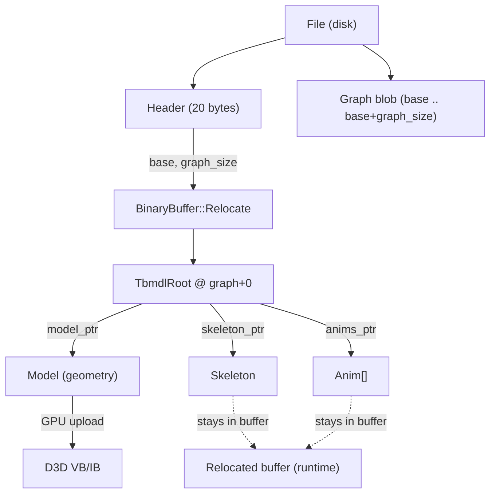
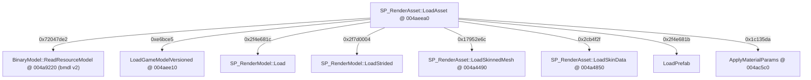
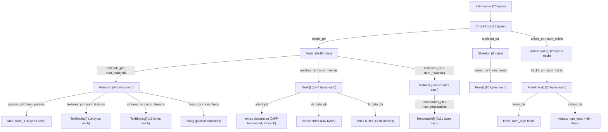

# BMDL v2 — Master Format Specification

Single source of truth: struct layouts are defined in `bmdl_schema.py`.
Validation tool: `tools/validate_bmdl.py` (see [Section 6](#6-source-of-truth--validation-sweep)).

Cross-references:
- Animation subsystem detail: [BMDL_ANIMATION.md](BMDL_ANIMATION.md)
- Material/shader detail: [BMDL_MATERIALS.md](BMDL_MATERIALS.md)

Tags: **[measured]** = verified against raw file bytes; **[binary]** = confirmed in Darkspore.exe via Ghidra; **[sweep]** = observed across the full local corpus via `tools/validate_bmdl.py`.

---

## 1. Container & Header

Every `.bmdl` file begins with a 20-byte fixed header, followed immediately by the *graph blob*.

| offset | type | value / meaning |
|-------:|------|-----------------|
| +0     | u32  | `1` (word0 sentinel) |
| +4     | char[4] | `bmdl` (bytes `62 6D 64 6C`) |
| +8     | u32  | `2` (version; `ReadResourceModel` rejects anything else) |
| +12    | u32  | `base` — file offset where the graph blob starts |
| +16    | u32  | `graph_size` — byte length of the graph blob |

**[binary]** `BinaryModel::ReadResourceModel @ 004a9220` checks `word0 == 1`, magic == `"bmdl"`, `version == 2`, then calls `BinaryBuffer::Relocate`.

**Pointers are graph-relative.** Every `ptr` / `cstr` field stores a `u32` offset from `base` (not from the start of the file). A value of `0` means null. After relocation the game adds `base` to each pointer; the importer performs the same arithmetic via `Reader._abs(graphrel) = base + graphrel`.

**[measured]** Example (`creatureeditor_el_anime_arm.bmdl`): `base = 3216`, `graph_size = 866660`.

---

## 2. Graph Relocation

**[binary]** Load sequence in `BinaryModel::ReadResourceModel @ 004a9220`:

1. Validate header (word0, magic, version).
2. Call `BinaryBuffer::Relocate` — walks every pointer slot in the graph blob and converts each graph-relative offset to an absolute in-process address.
3. Read the `TbmdlRoot` at graph offset 0 (`*pRelocatedBase`). The four root fields are `pRelocatedBase[0..3]` = `model_ptr`, `skeleton_ptr`, `num_anims`, `anims_ptr`.
4. Upload geometry to the GPU: mesh vertex buffers and index buffers are `CreateVertexBuffer` / `CreateIndexBuffer` / `memcpy`-ed from the graph.
5. The skeleton and animations **stay in the relocated buffer** (`model+0x1c`, `model+0x24`, buffer at `model+0x30`) and are consumed later by the runtime animation system.



---

## 3. Asset Dispatch

**[binary]** `SP_RenderAsset::LoadAsset @ 004aeea0` dispatches by a 32-bit asset-type hash.

| hash | loader |
|------|--------|
| `0x72047de2` | `BinaryModel::ReadResourceModel @ 004a9220` — **bmdl v2 (this document)** |
| `0xe6bce5`   | `SP_EditorModel::LoadFromText` / `LoadGameModelVersioned @ 004aee10` |
| `0x2f4e681c` | `SP_RenderModel::Load` |
| `0x2f7d0004` | `SP_RenderModel::LoadStrided` |
| `0x17952e6c` | `SP_RenderAsset::LoadSkinnedMesh @ 004a4490` |
| `0x2cb4f2f`  | `SP_RenderAsset::LoadSkinData @ 004a4850` |
| `0x2f4e681b` | `LoadPrefab` |
| `0x1c135da`  | `ApplyMaterialParams @ 004ac5c0` |



---

## 4. bmdl v2 Structure Tree



---

## 5. Struct Layouts

All offsets are byte offsets within the struct. All values are little-endian. Sources: comments and field definitions in `bmdl_schema.py`.

### TbmdlRoot (stride 16 bytes)

Root of the graph blob; located at graph offset 0.

| offset | type | field |
|-------:|------|-------|
| +0     | ptr  | `model_ptr` |
| +4     | ptr  | `skeleton_ptr` |
| +8     | i32  | `num_anims` |
| +12    | ptr  | `anims_ptr` |

### Model (stride 0x48 = 72 bytes)

**[binary]** Confirmed by `BinaryModel::ReadResourceModel @ 004a9220` LayoutBuilder AddField calls. Offsets +0..+0x1f are GPU-side bookkeeping (not in this table); the named fields begin at +0x20.

| offset | type | field |
|-------:|------|-------|
| +0x20  | cstr | `name_ptr` |
| +0x28  | i32  | `num_materials` |
| +0x2c  | ptr  | `materials_ptr` |
| +0x30  | i32  | `num_meshes` |
| +0x34  | ptr  | `meshes_ptr` |
| +0x38  | i32  | `num_instances` |
| +0x3c  | ptr  | `instances_ptr` |
| +0x40  | i32  | `num_tags` |
| +0x44  | ptr  | `tags_ptr` |

### Material (stride 44 bytes)

**[measured + binary]** Confirmed in `ApplyMaterialParams @ 004ac5c0`. Ghidra struct: `bmdl_Material`.

| offset | type | field |
|-------:|------|-------|
| +0     | cstr | `name_ptr` (shader name, e.g. `labsChromeVertColor`) |
| +4     | u32  | `name_hash` (FNV-1, lowercase) |
| +8     | u32  | `flags` |
| +12    | i32  | `num_params` |
| +16    | ptr  | `params_ptr` → `MatParam[]` |
| +20    | i32  | `num_floats` |
| +24    | ptr  | `floats_ptr` → `float[]` (packed constant buffer) |
| +28    | i32  | `num_textures` |
| +32    | ptr  | `textures_ptr` → `TexBinding[]` |
| +36    | i32  | `num_streams` |
| +40    | ptr  | `streams_ptr` → `TexBinding[]` (vertex stream bindings) |

### MatParam (stride 16 bytes)

**[measured + binary]** Ghidra struct: `bmdl_MatParam`. Value = `floats[float_offset : float_offset + dimension]`.

| offset | type | field |
|-------:|------|-------|
| +0     | cstr | `name_ptr` |
| +4     | u32  | `name_hash` |
| +8     | u32  | `float_offset` (index into the parent material's float array) |
| +12    | u32  | `dimension` (number of floats) |

### TexBinding (stride 16 bytes)

**[measured]** Ghidra struct: `bmdl_TexBinding`. Used for textures (key = slot, value = filename) and vertex stream bindings (key = semantic, value = source).

| offset | type | field |
|-------:|------|-------|
| +0     | cstr | `key_ptr` |
| +4     | u32  | `key_hash` |
| +8     | cstr | `value_ptr` |
| +12    | u32  | `value_hash` |

### Skeleton (stride 8 bytes)

| offset | type | field |
|-------:|------|-------|
| +0     | i32  | `num_bones` |
| +4     | ptr  | `bones_ptr` |

### Bone (stride 80 bytes)

**[measured]** Bone stride confirmed by `read_array` with stride 80. Inverse-bind matrix is model-space, D3D row-major; translation is in columns 12..14 (`m[12]`..`m[14]`).

| offset | type   | field |
|-------:|--------|-------|
| +0     | cstr   | `name_ptr` |
| +4     | u32    | `name_hash` (FNV-1) |
| +8     | i32    | `parent_index` (`-1` = root bone) |
| +12    | u32    | `pad` |
| +16    | f32x16 | `inv_bind` (16 floats = 4×4 inverse-bind matrix) |

### AnimHeader (stride 20 bytes)

**[measured]** Ghidra struct: `bmdl_AnimHeader` (plate comment on `ReadResourceModel @ 004a9220`).

| offset | type | field |
|-------:|------|-------|
| +0     | cstr | `name_ptr` |
| +4     | u32  | `name_hash` |
| +8     | f32  | `duration` (in frames) |
| +12    | u32  | `num_tracks` |
| +16    | ptr  | `tracks_ptr` |

### AnimTrack (stride 20 bytes)

**[measured]** Ghidra struct: `bmdl_AnimTrack`. `category`: 1 = POS (dim 3), 2 = ROT quaternion xyzw (dim 4), 3 = SCALE (dim 3). `times_ptr` and `values_ptr` are contiguous: `values_ptr - times_ptr == num_keys * 4` (validated across all tracks in the corpus).

| offset | type | field |
|-------:|------|-------|
| +0     | i32  | `bone_index` |
| +4     | u32  | `category` |
| +8     | u32  | `num_keys` |
| +12    | ptr  | `times_ptr` (→ `num_keys` f32 values) |
| +16    | ptr  | `values_ptr` (→ `num_keys × dim` f32 values) |

### Mesh (stride 0x44 = 68 bytes)

**[binary]** Loop `byteOff += 0x44` confirmed in `ReadResourceModel @ 004a9220`. First 0x20 bytes are a bounding box (8 floats: min[3], pad, max[3], pad/volume) — not modelled here. Index buffer uses 16-bit indices: `memcpy` size = `index_count * 2`.

| offset | type | field |
|-------:|------|-------|
| +0x20  | cstr | `name_ptr` |
| +0x2c  | u32  | `flags` |
| +0x30  | ptr  | `vdecl_ptr` (→ 0xFF-terminated vertex declaration array) |
| +0x34  | ptr  | `vb_data_ptr` (raw vertex buffer bytes) |
| +0x38  | ptr  | `ib_data_ptr` (raw index buffer, 16-bit indices) |
| +0x3c  | u32  | `vertex_count` |
| +0x40  | u32  | `index_count` |

### Instance / LOD (stride 0x2c = 44 bytes)

**[binary]** Source stride 0x2c, GPU-side copy stride 0x24; confirmed by LayoutBuilder AddField `byteOff += 0x2c`. First 0x18 bytes are a bounding box (6 floats) — not modelled here. `mesh_index` selects which `Mesh`'s VB/IB this LOD draws.

| offset | type | field |
|-------:|------|-------|
| +0x20  | u32  | `mesh_index` |
| +0x24  | i32  | `num_renderables` |
| +0x28  | ptr  | `renderables_ptr` |

### Renderable (stride 0x2c = 44 bytes)

**[binary]** Loop `subSrcByteOff += 0x2c` confirmed in `ReadResourceModel`. First 0x18 bytes are a bounding box (6 floats). `index_start + index_count` partitions the owning mesh's index buffer **[measured]** (verified on `scaldron_terrain_a.bmdl`). Engine lookup: `material_index * 0x30 + materials_base`.

| offset | type | field |
|-------:|------|-------|
| +0x20  | i32  | `material_index` |
| +0x24  | u32  | `index_start` (offset into mesh's 16-bit index buffer) |
| +0x28  | u32  | `index_count` |

### Vertex Declaration Element (8 bytes per element, 0xFF-terminated)

**[binary]** Confirmed in `ReadResourceModel @ 004a9220`, asm addresses 004a9d0e / 004a9da7 / 004a9e09 / 004a9e26. The array terminates when the `stream` word equals `0xFF` (`CMP word ptr [EAX], 0xff`).

| byte offset | type | field |
|------------:|------|-------|
| +0          | u16  | `stream` (`0xFF` or `0xFFFF` = terminator) |
| +2          | u16  | `offset` (byte offset of this element within the vertex) |
| +4          | u8   | `d3d_usage` (copied verbatim to `D3DVERTEXELEMENT9.Usage`) |
| +5          | u8   | (unused / padding) |
| +6          | u8   | `type_id` (switch selector, see table below) |
| +7          | u8   | `usage_index` (copied verbatim to `D3DVERTEXELEMENT9.UsageIndex`) |

**`type_id` → `D3DDECLTYPE` mapping** (switch at 004a9db1):

| type_id | D3DDECLTYPE value | name |
|--------:|------------------:|------|
| 0 | `0x00` | `FLOAT1` |
| 1 | `0x02` | `FLOAT3` |
| 2 | `0x13` (19) | — |
| 3 | `0x14` (20) | — |
| 4 | `0x06` | `UBYTE4` |
| 5 | `0x03` | `FLOAT4` |
| 6 | `0x0F` (15) | — |
| 7 | `0x0E` (14) | — |
| default | `0xFFFFFFFF` | `UNUSED` |

---

## 6. Source of Truth & Validation [sweep]

`bmdl_schema.py` is the **single source of truth** for all struct layouts. The importer (Phase 2) and `tools/validate_bmdl.py` both import it directly. No heuristics are used; every assertion in the validator is derived from field constraints stated in the schema.

`tools/validate_bmdl.py` parses the entire local corpus (`BMDL_environments`, 1234 files) with zero failures.

**Corpus run output (verbatim):**

```
files=1234 ok=1234 fail=0
struct coverage: {'AnimHeader': 47, 'AnimTrack': 2382, 'Bone': 675, 'Instance': 2271,
'MatParam': 32855, 'Material': 2909, 'Mesh': 2271, 'Model': 1234, 'Renderable': 7530,
'Skeleton': 34, 'TbmdlRoot': 1234, 'TexBinding': 5791}

--- coverage report ---
total structs parsed : 59233
files with zero meshes AND zero anims : 2
```

**Per-struct counts:**

| struct | instances parsed |
|--------|----------------:|
| TbmdlRoot | 1234 |
| Model | 1234 |
| Material | 2909 |
| MatParam | 32855 |
| TexBinding | 5791 |
| Mesh | 2271 |
| Instance | 2271 |
| Renderable | 7530 |
| Skeleton | 34 |
| Bone | 675 |
| AnimHeader | 47 |
| AnimTrack | 2382 |
| **Total** | **59233** |

All 12 struct types are exercised. 2 files contain neither meshes nor animations (likely stub/LOD-only entries).

---

## 7. Alternative Formats

The dispatch table in [Section 3](#3-asset-dispatch) covers all asset types loaded by `SP_RenderAsset::LoadAsset @ 004aeea0`. This document covers only **bmdl v2** (hash `0x72047de2`). The other loaders are listed below for reference; detailed struct layouts are reserved for follow-up RE (Task 8).

| hash | loader | notes |
|------|--------|-------|
| `0xe6bce5` | `LoadGameModelVersioned` / `SP_EditorModel::LoadFromText` | versioned text/binary model (v8/v9 streaming format); detailed layout: see follow-up RE (Task 8) |
| `0x17952e6c` | `SP_RenderAsset::LoadSkinnedMesh @ 004a4490` | standalone skinned mesh asset; detailed layout: see follow-up RE (Task 8) |
| `0x2cb4f2f` | `SP_RenderAsset::LoadSkinData @ 004a4850` | skin weight / bind-pose data; detailed layout: see follow-up RE (Task 8) |
| `0x2f4e681c` | `SP_RenderModel::Load` | render model (non-bmdl path); detailed layout: see follow-up RE (Task 8) |
| `0x2f7d0004` | `SP_RenderModel::LoadStrided` | strided variant of RenderModel::Load; detailed layout: see follow-up RE (Task 8) |
| `0x2f4e681b` | `LoadPrefab` | scene prefab / entity collection; detailed layout: see follow-up RE (Task 8) |
| `0x1c135da` | `ApplyMaterialParams @ 004ac5c0` | material parameter overlay (applies on top of an already-loaded model); detailed layout: see follow-up RE (Task 8) |
