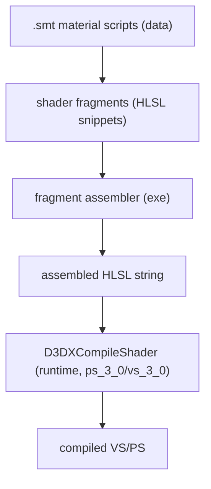
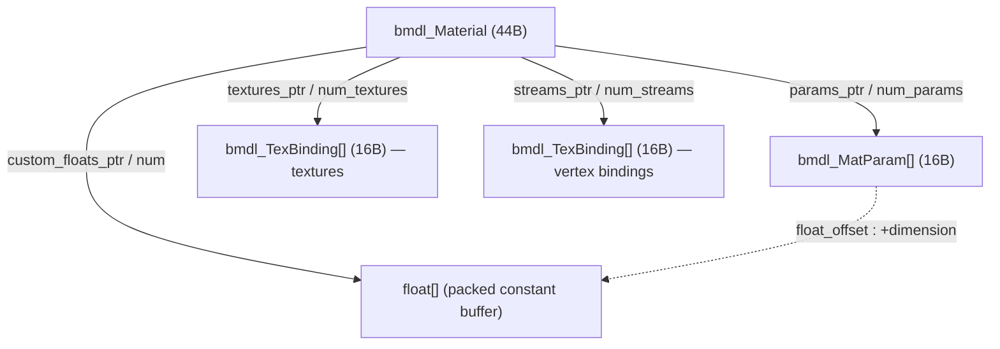

# BMDL — Materials & Shaders (reverse engineering + importer reference)

This document explains, end to end, how Darkspore's material/shader system works, how we
recovered it, how each shader is interpreted, and how the importer reproduces it in Blender.

Sources:
- Raw bytes of real `.bmdl` files (`creatureeditor_el_anime_arm.bmdl`, `scaldron/scaldron_terrain_a.bmdl`).
- `Darkspore.exe` decompiled in Ghidra (`BinaryModel::ReadResourceModel`, `SP_RenderAsset::ApplyMaterialParams`, the shader builders).
- The **`.smt` material scripts** extracted from `CompiledMaterials.package` with SporeModder-FX.

Tags: **[measured]** = verified against real file bytes; **[binary]** = confirmed in the game code;
**[script]** = read verbatim from the `.smt` shader fragments.

---

## 1. How we recovered the shaders (the trail)

The labs shader names (`labsChromeVertColor`, `labsSuperMix`, …) do **not** exist in the
executable. Ghidra confirmed this: the only HLSL embedded in the exe is the Scaleform/UI path
(`cxmul`/`cxadd`/`YUVToRGB`/skinning). The 3D material shaders are **data-driven and compiled at
runtime**:



**[binary] Evidence in Ghidra:**
- Shader model 3.0 strings `vs_3_0` / `ps_3_0`; runtime `D3DXCompileShader`.
- Vertex fragment assembler `FUN_008dc2c0` → compile primitive `FUN_007e20b0` (builds `cVertOut main(cVertIn In)`).
- Pixel fragment assembler `FUN_008da310` → compile primitive `FUN_007e2190` (builds `cFragOut main(cFragIn In)`, uses a `Current` accumulator).
- Both concatenate per-fragment HLSL into a global buffer, then compile.
- Built-in shader **dump** flags are command-line options (via `Core::GetCommandLineOption`, prefix `-` or `/`): `-dumpFragmentShaders`, `-dumpDirectShaders`, `-dumpShaders`. Running the game with one of these dumps the generated HLSL.
- `MaterialManager` loads `config.smt` / `<name>.smt` at boot.

**Extraction we actually used:** open `Data/CompiledMaterials.package` (DBPF) with SporeModder-FX. It
unpacks into:
- `materials_shader_fragments~/…/NNN(name).pixel_fragment` / `.vertex_fragment` — **the HLSL math** (plain ArgScript text). 328 pixel + 277 vertex fragments.
- `materials_compiled_states_link~/…/<shaderName>.smt_t` — material → shaderIDs + D3D render states.
- `materials_shaders~/…/0x00000003.smt` — the per-shaderID fragment recipe. **This is the one file SMFX failed to unpack**, but it did **not** block us: each family's named `*PS`/`*VS` fragment is self-contained, so the look is fully determined without the recipe.

**Name hashing.** Asset/material/param names are resolved by **FNV-1 (32-bit), lowercase-normalised**
— implemented as `utils.darkspore_hash` (mode 1). Validated:
`darkspore_hash("labsChromeVertColor") == 0x74EB436B` == the BMDL material `name_hash`. Useful to map
the hash-named files and texture references.

---

## 2. Material format inside the BMDL graph



### bmdl_Material — 44 bytes  [measured + binary]
| off | type | field |
|----:|------|-------|
| +0  | u32  | name_ptr (the **shader** name, e.g. `labsChromeVertColor`) |
| +4  | u32  | name_hash (FNV-1) |
| +8  | u32  | flags |
| +12 | i32  | num_params |
| +16 | u32  | params_ptr → `bmdl_MatParam[]` |
| +20 | i32  | num_custom_floats |
| +24 | u32  | custom_floats_ptr → `float[]` |
| +28 | i32  | num_textures |
| +32 | u32  | textures_ptr → `bmdl_TexBinding[]` |
| +36 | i32  | num_streams |
| +40 | u32  | streams_ptr → `bmdl_TexBinding[]` |

### bmdl_MatParam — 16 bytes  [measured + binary]
`{ name_ptr, name_hash, float_offset, dimension }`. The value is
`custom_floats[float_offset : float_offset + dimension]`. The float array is a packed constant
buffer; params only name slices of it.

### bmdl_TexBinding — 16 bytes  [measured]
`{ key_ptr, key_hash, value_ptr, value_hash }`. Used for **textures** (key = slot, value = file name,
e.g. `diffuseMap → editor_machine_upp_1_D`) and for **vertex stream bindings** (key = semantic, value
= source, e.g. `Color0 → color:colorSet1`).

These three structs are defined in the Ghidra project as `bmdl_Material`, `bmdl_MatParam`,
`bmdl_TexBinding` (see plate comment on `ApplyMaterialParams @ 004ac5c0`).

---

## 3. The shader pipeline (deferred) and its backbone

Darkspore is a **deferred** renderer. A material is drawn in several passes: an *unpack* VS
decompresses the vertex, a *deferred* PS writes the G-buffer (albedo / world-bumped normal / gloss /
specExponent / depth), lights are accumulated into a light buffer, and a *final* PS reads the albedo
+ light buffer and produces the on-screen colour (plus reflection/emissive). Fragments write into a
shared `Current` struct.

**Backbone facts (true for all lit families):**

- **Normal map is PACKED.** The deferred PS samples it with swizzle `.agbr`, so:
  - `R = gloss` (reflection / specular mask), `G = normalY`, `B = specExponent`, `A = normalX`.
  - The tangent-space normal is rebuilt from `(A, G)`; `R` and `B` are *not* normal data.
- **`diffuse.alpha` = glow/emissive mask** (`diffuseGlow = diffuse.rgb * diffuse.a`).
- **diffuseLight buffer**: `rgb` = accumulated diffuse light, `a` = specular intensity.
- Vertex-shader param packing (per `*VS` fragment):
  - `vertexColor = In.color * DiffuseTint * DiffLevel`
  - `effectiveSpecular = SpecularTint * SpecLevel`
  - `effectiveReflect  = ReflectTint * ReflectLevel`
  - `glow = GlowLevel / 16`; UV = `uv * TileUV + OffsetUV (+ ScrollUV * time)`

**Universal lit final-colour formula (forward approximation used by the importer):**
```
albedo   = diffuseTex.rgb * DiffuseTint * DiffLevel  (* vertexColor for "VertColor" shaders)
glowMask = diffuseTex.alpha
gloss    = normalTex.R
normal   = decode(nx = normalTex.A, ny = normalTex.G)
color = albedo * sceneDiffuseLight
      + sceneSpecular * (SpecularTint * SpecLevel)
      + [reflective] texCUBE(env, reflect(V,N).xzy) * (ReflectTint * ReflectLevel) * gloss
      + albedo * glowMask * EmissiveLevel
bloom (MRT2) = albedo * glowMask * GlowLevel
```

---

## 4. Shader catalog — 33 families  [measured: sweep of 1232 BMDLs]

| shader | × | textures | distinctive params | family / behaviour |
|--------|--:|----------|--------------------|--------------------|
| labsSubMix | 698 | diffuse,normal | `*0` (single layer) | terrain (single splat layer) |
| labsChromeVertColor | 584 | diffuse,normal,**envMap** | Reflect/Spec/Diff Level+Tint | reflective (chrome) + vertex colour |
| labsGenericVertColors | 241 | diffuse,normal | Diff/Spec/Normal/Ambi | lit + vertex colour |
| labsSuperMix | 223 | diffuse1-4,normal1-4 | `*1..*4` per layer | terrain (4-layer blend by colorSet1) |
| labsGeneric | 192 | diffuse,normal | **`SpecExponent`** | lit |
| labsUnlitMaskedScrollAdditive | 122 | diffuse | Scroll/Rate/Delay | unlit additive FX with scrolling |
| labsFloraVertColor | 112 | diffuse,normal | **`Flexibility`** | foliage (wind sway) |
| labsUnlitBlend | 99 | diffuse | Emissive/Glow | unlit alpha-blend FX |
| labsFlora | 94 | diffuse,normal | `Flexibility` | foliage |
| labsChrome | 90 | diffuse,normal,**envMap** | Reflect/Spec | reflective (no vertex colour) |
| labsUnlit | 76 | diffuse | Emissive/Glow | solid unlit |
| labsUnlitMaskedScroll | 63 | diffuse | Scroll | unlit scroll/mask |
| labsTechVertColor | 48 | diffuse,normal,**envMap**,**scrollMap** | Reflect + Scroll(Offset/Tile/Rate)UV | reflective + animated layer |
| labsUnlitMaskedScrollVertColorAdditive | 47 | diffuse | Scroll | unlit additive FX |
| labsCrystalVertColor | 41 | diffuse,normal,**envMap** | **`RefractLevel`/`RefractTint`** | crystal (reflection + refraction + fresnel) |
| labsCrystal | 41 | diffuse,normal,**envMap** | Refract/Reflect | crystal |
| labsUnlitBlendCulled | 19 | diffuse | — | unlit blend (backface cull) |
| labsSimple | 18 | — | Diff/Spec/Ambi | flat lit colour (no texture) |
| labsUnlitScroll | 15 | diffuse | Scroll | unlit scroll |
| labsSphereMaskedScrollAdditive | 15 | diffuse | **`EdgeFalloff`** | spherical FX (shield) |
| labsCutout | 13 | diffuse,normal | — | lit + alpha cutout |
| labsTech | 10 | diffuse,normal,envMap,scrollMap | Reflect+Scroll | reflective + scroll |
| labsUnlitScrollSolid | 9 | diffuse | Scroll | opaque unlit scroll |
| labsSunbeam | 6 | diffuse | **`FadeStart`/`FadeEnd`** | god rays |
| labsSpaceDome | 6 | diffuse,**starMap** | Fixed/StarScrollUV | sky/star dome |
| labsFloraBlend | 6 | diffuse | `Flexibility` | foliage alpha-blend |
| **Model** | 4 | — | **`ambient`/`diffuse`/`specular`/`specPow`/`glow`** (lowercase) | **legacy Maxis material (non-labs)** |
| labsSphereMaskedScroll | 4 | diffuse | `EdgeFalloff` | spherical FX |
| labsVolumeFog | 4 | diffuse | **`FogAmp`** | volumetric fog |
| labsPuddle | 4 | diffuse,normal,**puddleMap**,**skyMap** | Sky/Normal Offset/Tile | reflective puddle |
| labsFloraVertColor2 | 3 | diffuse,normal | **`FlexibilityXYZ`** | foliage (3D sway) |
| labsId | 1 | — | — | selection / ID pass (no visible colour) |
| labsUnlitLayeredScroll | 1 | diffuse0,diffuse1,**maskMap** | Diff0/1 + Mask scroll | dual animated diffuse + mask |

### Exact per-family math (read verbatim from the fragments)  [script]

- **Generic / GenericVertColors**: `albedo*light + light.a*SpecularTint + albedo*glowMask*EmissiveLevel`. VertColor multiplies vertex colour. (Cutout = + alpha clip on `diffuse.a`.)
- **Chrome / …VertColor**: Generic **+ `texCUBE(env, reflect(V,N).xzy) * ReflectTint*ReflectLevel * gloss`** (gloss = normal.R masks the reflection per-texel).
- **Tech / …VertColor**: Chrome **+ a scroll layer** (`scrollMap` sampled at a fixed and a scrolling UV, added emissively).
- **Crystal / …VertColor**: screen-space **refraction × RefractTint** + reflection × **fresnel(bias 0.2, power 4)** × gloss, then `lerp(→ diffuse, DiffLevel)` + emissive.
- **SubMix**: single terrain layer, `diffuse × DiffuseTint0`, lit. No vertex colour.
- **SuperMix**: 4 layers blended as a **weighted sum** using the **normalised** vertex-colour RGBA channels as weights (`w = color / (r+g+b+a + 0.001)`); each layer has its own `Tile{1..4}UV` and `DiffuseTint{1..4}`; the four normals are summed weighted.
- **Flora / …VertColor**: Generic + **wind in the VS** (`Flexibility` / `FlexibilityXYZ` displace the position over time). **FloraBlend** is unlit (`diffuse + glow`).
- **Unlit / Blend / Scroll / Sunbeam**: `emission = diffuse*vColor*DiffuseTint + glow*EmissiveLevel`; bloom `= glow*GlowLevel`. Additive/alpha decided by render state.
- **UnlitMaskedScroll**: scroll.rgb with alpha = fixed.a. **UnlitLayeredScroll**: `lerp(diff0,diff1,vColor.a)*vColor.rgb`, alpha ×= mask.a × shape.r.
- **SpaceDome**: `lerp(stars, scroll, fixed.a) + glow`. **SphereMaskedScroll**: scroll.rgb, alpha = fixed.a × edge(EdgeFalloff). **VolumeFog**: `(vColor.rgb, fogDepth × FogAmp)`.
- **Simple**: `DiffuseTint × light + light.a × SpecularTint` (no texture). **Id**: writes nothing (transparent). **Model** (legacy): `diffuse`/`specular`/`specPow`/`glow` lowercase params → Principled.

---

## 5. How the importer maps shaders to Blender (`io_material.py`)

The importer reads params generically (`bmdl_MatParam` → slice of `custom_floats`) and classifies the
shader into a family. One generic reader covers all 33; only the family decides blend mode, reflection,
cutout and wind.

| family | Blender graph |
|--------|---------------|
| lit / submix / cutout | Principled. Base = `diffuse × DiffuseTint × DiffLevel (× vertexColor)`; **packed-normal decode** → Normal; **roughness = 1 − gloss**; specular from `SpecularTint × SpecLevel` (0 ⇒ matte); emission = `albedo × diffuse.a × EmissiveLevel`. Cutout adds alpha-clip. |
| reflective (chrome/tech) | Principled + a Glossy reflection mixed in by `gloss × ReflectLevel`, tinted by `ReflectTint` (uses the envMap as the reflection colour). |
| crystal | Principled with Transmission (glass) + low roughness + IOR (refraction). |
| supermix | 4 layers, each its own UV mapping + `DiffuseTint`; blended as a weighted sum by the **normalised** vertex-colour RGBA channels. |
| flora | Principled + alpha-clip (cut-out leaves). FloraBlend → emission. |
| unlit / scroll / sphere / sunbeam | **Emission** shader; additive via an Add Shader with a Transparent BSDF; masked via Mix Shader on `diffuse.a`. |
| fog | Emission × transparency by `FogAmp`. |
| simple | flat Principled colour. id | transparent. legacy "Model" | Principled from lowercase params. |

The vertex-colour node uses the layer **`Col`** (the name `io_mesh` creates; it is the game's
`colorSet1`).

---

## 6. Bugs found and fixed

| # | bug | fix |
|---|-----|-----|
| 1 | Old importer ignored all params → Principled defaults (specular 0.5, roughness 0.5) ⇒ everything plastic/over-shiny | read params; matte when `SpecularTint==0`; roughness from gloss |
| 2 | Normal map fed as raw RGB → wrong normals, gloss ignored | packed decode (R=gloss, A/G=normal) |
| 3 | `diffuse.alpha` (glow mask) ignored | emission from `albedo × diffuse.a × EmissiveLevel` |
| 4 | Reflection flat (no gloss mask), envMap sampled as equirect | glossy reflection masked by `gloss × ReflectLevel` |
| 5 | SuperMix used 3-channel nested lerp + shared UV + no tint | 4-channel normalised weighted sum + per-layer UV/tint |
| 6 | **Vertex-colour layer name mismatch**: material referenced `colorSet1` but the mesh layer is `Col` ⇒ VertColor materials black/uniform, SuperMix blend broken | point the vertex-colour node at `Col` |
| 7 | **Material cache keyed by renderable index `ri`** (not mesh/`imat`) ⇒ across meshes the same `ri` reused the wrong cached material ⇒ wrong textures, SuperMix faces getting another mesh's Generic ("rainbow") | cache by `imat` (`{file}|mat|{imat}`); a material is shared by `imat`, distinct `imat` ⇒ distinct material |

---

## 7. Known limitations (pipeline differences, not parse bugs)

- **Deferred → forward.** The game accumulates lighting in a G-buffer; Blender uses scene lights, so
  the lit term is an approximation (a dark world makes lit materials dark).
- **Per-material envMap cubemap.** The reflection `.dds` is a **6-face vertical strip** (e.g. 256×1536),
  which Blender cannot sample natively as a cube. The importer approximates the reflection (gloss-masked,
  `ReflectTint × ReflectLevel`); exact reproduction would require converting the strip to equirectangular.
- **SubMix terrain decals.** Adjacent/overlapping `labsSubMix` layers blend **softly via the deferred
  decal pass** (drawn with ZWrite off, composited in the G-buffer). The shader outputs opaque
  (`color.a = 1`), there is **no per-material blend mask** (the diffuse alpha is the *glow* mask, not an
  edge mask), and no vertex-alpha mask. So in Blender they import as opaque overlays with hard polygon
  edges. The geometry and textures are faithful; only the soft splat blend is missing.
- **Puddle.** `labsPuddle`'s shader is not in `CompiledMaterials` (only referenced by the Nocturna
  `Moon1_puddle_*` models); it is handled best-effort as a reflective surface. The exact definition is
  presumably in `Levels.package`.

---

## 8. Reproducing / verifying

- Extract `Data/CompiledMaterials.package` with SporeModder-FX → `materials_shader_fragments~` holds the
  HLSL fragments (plain text).
- Or run the game with `-dumpFragmentShaders` (`-`/`/` prefix) to dump the fully-assembled HLSL.
- `utils.darkspore_hash(name)` (FNV-1, lowercase) resolves any name → hash.
- Per-file material dumps used during RE live next to the test files
  (`_dump_mat.py`, `_dump_matparams.py`).
