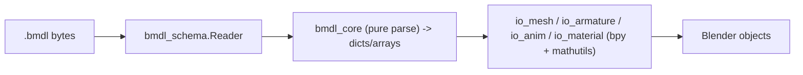

# BMDL importer refactor onto the schema (Phase 2 design)

Status: approved approach (A — layered). Phase 2 of three.

## Goal

Refactor the importer so that **all `.bmdl` parsing is driven by the verified `bmdl_schema.py`**
(Phase 1), removing the fragile heuristics; **decouple the parser from `bpy`/`mathutils`**; and **fix
the coordinate handedness/winding** (the "flip"). Everything is guarded by a **golden + spec** headless
test net so the currently-working **animation and materials do not regress**.

## Scope

In scope:
- Rewrite `bmdl_core.py` into a **pure parser** (no `bpy`, no `mathutils`) that consumes `bmdl_schema`
  and returns plain Python structures: model, materials (shader + params + textures + streams),
  skeleton (bones), animations (tracks → times/values), and meshes with **decoded** vertex attributes
  and index arrays + instances/renderables.
- Replace the importer's mesh heuristics — the index-mode scoring and densest-base-vertex search in
  `__init__.py`, and `mesh_flexible`'s shift search — with the exact schema-driven geometry parse.
- Decouple: `mathutils` is used **only** in the bpy build layer (`io_mesh`, `io_armature`, `io_anim`,
  `io_material`). The parser and schema are pure.
- Handedness/winding fix: confirm the convention (Darkspore is D3D / left-handed) and apply a single
  consistent transform (axis matrix + triangle winding reversal + normal orientation) in the build
  layer; validate visually.
- Tests: golden snapshots of current output + spec assertions for the intended fixes, headless.

Out of scope (Phase 3): dead-code cleanup beyond what the rewrite removes, performance/vectorization,
package rename, distribution (extension), and faithful-rendering follow-ups (cubemap reflections,
terrain splat blend, `labsPuddle`).

## Approach A — layered

A pure parser core (← `bmdl_schema`) with a thin bpy build layer that consumes it. Migrate
section-by-section; golden tests guard the already-working parts (anim/materials) at every step.

## Architecture / components

- **`bmdl_schema.py`** (Phase 1, source of truth) — extend with pure decode helpers as needed:
  vertex-attribute decode by vdecl usage/type, half-float, packed-normal. No `mathutils`.
- **`bmdl_core.py`** (rewritten, pure) — high-level parse functions returning plain structures, e.g.
  `parse(data) -> {header, model:{materials:[...], meshes:[{decl, positions, normals, uv_sets, colors,
  weights, bone_indices, indices, renderables:[{material_index, index_start, index_count}]}]},
  skeleton:[bones], anims:[{name, duration, tracks:[{bone_index, category, times, values}]}]}`.
  All decode (positions, normals incl. packed, UVs incl. half-float, colours, skin weights/indices,
  indices) lives here, selected by the vdecl element usage/type — exact, no heuristics.
- **`io_mesh` / `io_armature` / `io_anim` / `io_material`** — the bpy/mathutils build layer. External
  behaviour (the operator, its options) is unchanged; they now consume the pure parser's output.
  Handedness is applied here.
- **`__init__.py`** — orchestration: drop the heuristic mode-scoring/base-vertex loop; call the pure
  parser, then the build layer.
- **`tests/`** — a headless harness plus standalone parser tests (see Tests).

## Handedness / winding

Darkspore vertex and index data is D3D (left-handed). Confirm the up/forward axis and the triangle
winding order from the data and the binary, then apply a **single, consistent** transform in the build
layer: an axis matrix with the correct determinant, a triangle-winding reversal when the axis transform
mirrors (negative determinant), and normal orientation consistent with the winding. The user is the
visual ground truth (compares against the game); iterate until correct. Keep the change isolated to one
place so it is trivial to flip.

## Tests (golden + spec)

- **Golden capture (before refactor):** run the CURRENT importer on a representative fixture set
  (e.g. `creatureeditor_el_anime_arm`, `scaldron_terrain_a`, a chrome model, an unlit-FX model) and
  snapshot, per imported object: vertex count, triangle count, UV-layer names, colour-attribute names,
  material-slot count + shader/family per slot, action names + fcurve count per action, and a few
  pose-bone deformation values at sample frames. Store as JSON fixtures in `tests/`.
- **After each refactor step:** re-run and assert IDENTICAL for what must not change (animation
  fcurves/deformation, material count/families, UV/colour layers); assert the INTENDED changes for
  geometry exactness (counts derived from the schema) and handedness (winding/orientation).
- **Standalone parser tests:** assert the pure `bmdl_core.parse()` returns the expected structures for a
  known file (counts + a few values) WITHOUT Blender.
- The Phase 1 `tools/validate_bmdl.py` corpus sweep remains the parse gate.

## Acceptance criteria (Phase 2 done)

- `bmdl_core.py` imports neither `bpy` nor `mathutils`, and contains no index-mode/base-vertex
  heuristics; geometry is produced from `bmdl_schema`.
- The import operator produces objects via the pure-parser → build-layer flow.
- Golden tests pass: animation, material, UV, and colour outputs are unchanged on the fixture set.
- Geometry: per-mesh vertex/index counts and decoded attributes match the schema exactly (no scoring).
- Handedness: imported models have correct orientation and outward-facing normals, confirmed visually.
- `tools/validate_bmdl.py` still passes on the full corpus.

## Risks / mitigations

- **Regressing anim/materials** → golden snapshots captured BEFORE the refactor; assert unchanged after.
- **Handedness ambiguity** → user is the visual ground truth; the fix is one isolated transform, easy to
  flip; iterate.
- **Big rewrite breaking import** → migrate section-by-section, run tests after each; keep the operator
  interface stable.
- **Incomplete decoupling** → grep `bmdl_core.py` for `bpy`/`mathutils` at the end; must be zero.

## Phases (context)

- Phase 1 (done): schema + validator + docs + Ghidra.
- **Phase 2 (this spec):** refactor importer onto the schema, decouple, handedness, tests.
- Phase 3: cleanup, performance, distribution, faithful-rendering follow-ups.
